# Studio sulle annotazioni


## Introduzione

Lo studio sulle annotazioni ricopre una delle parti più importanti, perché avere una buona etichettatura dei video significa avere ottimi risultati nel momento in cui bisognerà identificare qual è l'azione tra Push, Release e Take che in un dato istante viene ripresa da hololens.

In questa cartella si effettuerà uno studio **qualitativo** e **quantitativo** sull'etichettatura. L'obiettivo che si vuole raggiungere è capire se l'etichettatura automatica non differisce molto da quella manuale, ovvero che è simile.


## Studio Qualitativo

Per effettuare lo studio qualitativo è stato utilizzato lo script Python VIA_Support per generare le annotazioni automatiche e il file via_project_2021-04-07-00-48-37-381_Manuale.json, che è stato annotato manualmente.

Osserviamo le seguenti immagini:

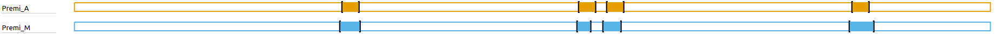


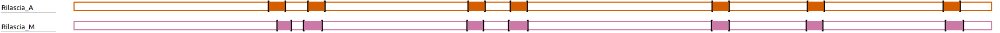


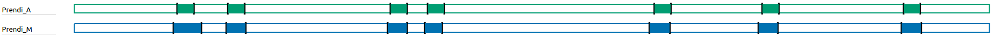

`_A` significa che l'etichetta è **automatica**, mentre `_M` significa che l'etichetta è **manuale**.

Quello che possiamo osservare è che alcune etichette automatiche si avvicinano molto a quelle manuali, ma nessuna (o quasi) coincide perfettamente. Andiamo a vedere più da vicino alcune di etichette.


### TAKE

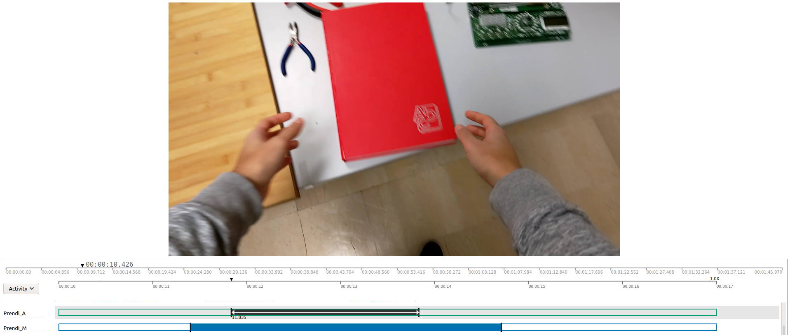

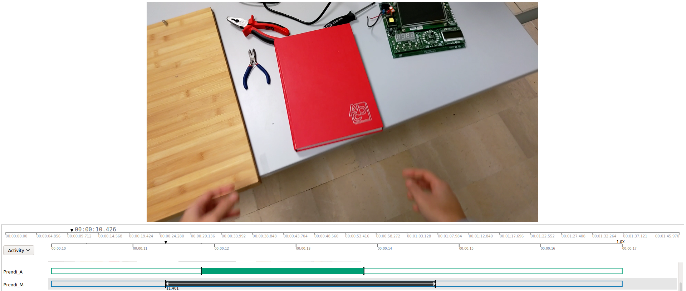

Come possiamo osservare i tempi iniziali delle due etichette non coincidono, ma nonostante ciò i frame sono molto simili tra di loro e si potrebbe comunque riconoscere un'azione di TAKE. 


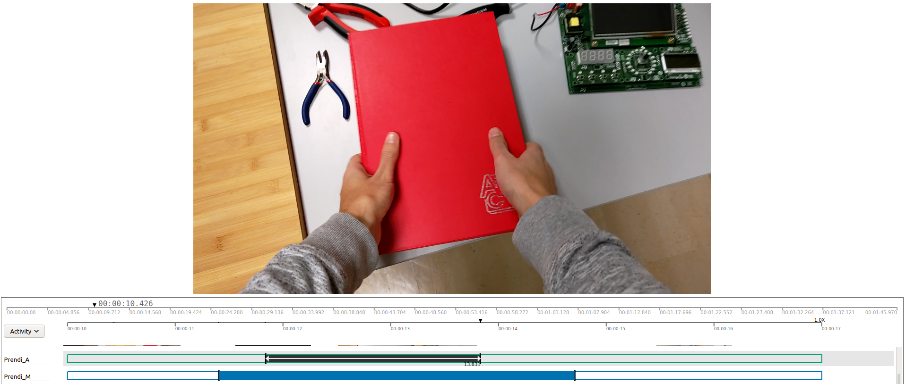

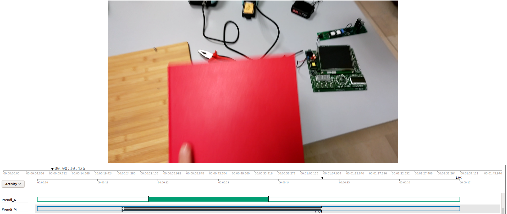

Anche in questo caso, vedendo l'azione per intera, in entrambe le etichettature è possibile riconoscere che si sta concludendo un'azione TAKE.


### RELEASE

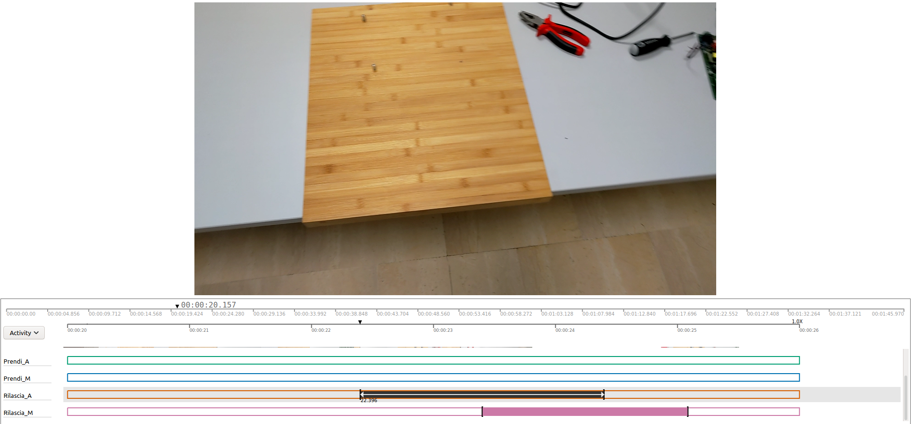

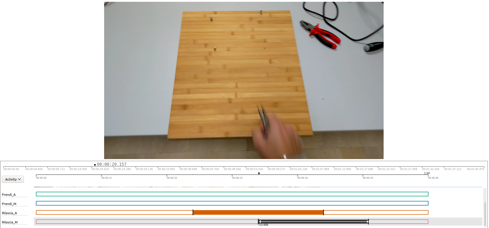

Possiamo subito osservare che tra l'inizio dell'etichettatura automatica e quella dell'etichettatura manuale c'è una differenza di circa 1 secondo.


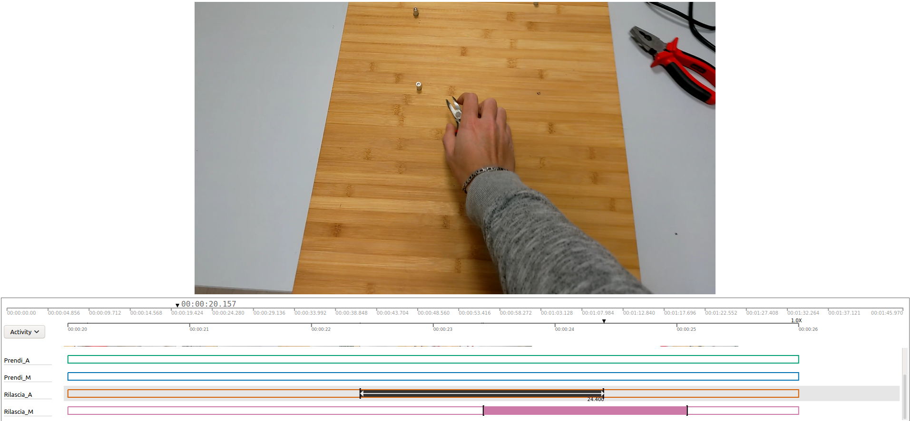

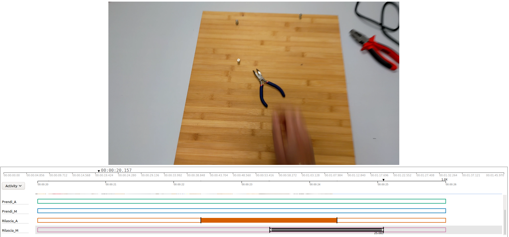

Anche tra le due parti finali è presente una differenza di 1 secondo, ma quello che possiamo osservare è che in entrambi i frame, guardando l'intera azione, è possibile riconoscere che si tratta di un'azione di RELEASE, nonostante la differenza tra le due etichettature.


### PUSH

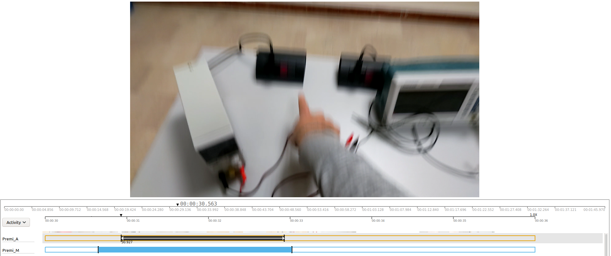

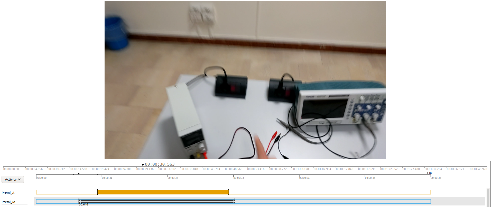

La differenza tra l'inizio delle due etichettature è di circa 300 millisecondi. Dalle immagini possiamo comunque osservare i frame di inizio sono abbastanza simili.


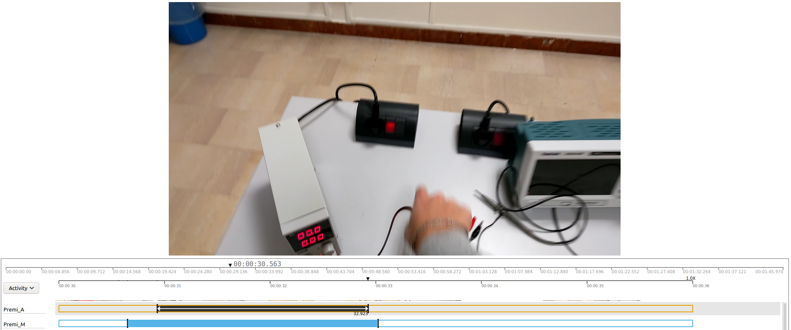

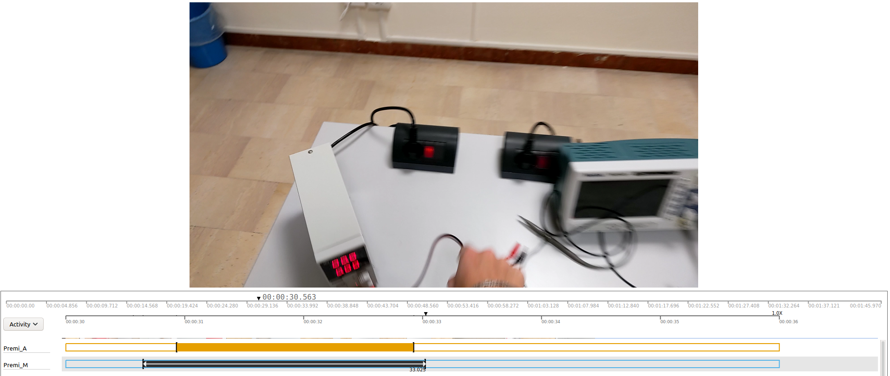

La differenza tra la fine delle due etichettature, invece, è solo di circa 100 millisecondi. Anche in questo caso possiamo osservare come i due frame sono molto simili tra di loro.


### Conclusione - studio qualitativo

In maniera qualitativa, ovvero osservando le etichettature manuali e quelle automatiche, possiamo concludere che esiste una differenza tra etichettatura automatica e manuale, ma nella maggior parte dei casi la differenza è davvero minima. Quindi, basandoci solo da un punto di vista qualitativo e sull'analisi di un singolo video, possiamo concludere che l'etichettatura automatica può andare pure bene.


## Studio Quantitativo

Per effettuare lo studio quantitativo si utilizzerà l'**indice di Jaccard**, che misura la similarità tra insiemi campionari, ed è definito come la dimensione dell'intersezione divisa per la dimensione dell'unione degli insiemi campionari.
$$
J(A,B)={{|A\cap B|} \over {|A\cup B|}}
$$
Supponiamo di avere la seguente etichettatura per un'azione di *PUSH*:

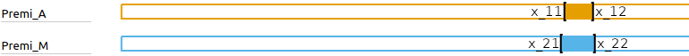

dove:

- $x_{11}$ rappresenta l'inizio dell'etichetta automatica;
- $x_{12}$ rappresenta la fine dell'etichetta automatica;
- $x_{21}$ rappresenta l'inizio dell'etichetta manuale;
- $x_{22}$ rappresenta la fine dell'etichetta manuale.

L'intersezione (I) e l'unione (U) possono essere definite come segue:
$$
I = \min(x_{1,2}, x_{2,2}) - \max(x_{1,1} - x_{2,1}) \\
U = \max(x_{1,2}, x_{2,2}) - \min(x_{1,1} - x_{2,1})
$$
Allora:
$$
J(Premi_A, Premi_M)={{|Premi_A\cap Premi_M|} \over {|Premi_A\cup Premi_M|}}= \\
= {{I} \over {U}}= \\
={{\min(x_{1,2}, x_{2,2}) - \max(x_{1,1} - x_{2,1})} \over {\max(x_{1,2}, x_{2,2}) - \min(x_{1,1} - x_{2,1})}}
$$


Adesso, possiamo calcolare la similarità tra tutte le etichette automatiche e quelle manuali.


```python
import json
from modules.extract_json import ExtractJSON

js = json.loads(
    ExtractJSON.get_json(
        "via_qualitative_study.json"
    )
)
js
```


    {'project': {'pid': '__VIA_PROJECT_ID__',
      'rev': '__VIA_PROJECT_REV_ID__',
      'rev_timestamp': '__VIA_PROJECT_REV_TIMESTAMP__',
      'pname': '001_Ripresa',
      'creator': 'VGG Image Annotator (http://www.robots.ox.ac.uk/~vgg/software/via)',
      'created': 1618820919692,
      'vid_list': ['1']},
     'config': {'file': {'loc_prefix': {'1': '', '2': '', '3': '', '4': ''}},
      'ui': {'file_content_align': 'center',
       'file_metadata_editor_visible': True,
       'spatial_metadata_editor_visible': True,
       'spatial_region_label_attribute_id': '',
       'gtimeline_visible_row_count': '4'}},
     'attribute': {'1': {'aname': 'Activity',
       'anchor_id': 'FILE1_Z2_XY0',
       'type': 1,
       'desc': 'Activity',
       'options': {},
       'default_option_id': ''}},
     'file': {'1': {'fid': '1',
       'fname': '/home/gigi-g/OneDrive/Tesi1/2021-04-07-00-48-37-381/2021-04-07-00-48-37-381_Video.mp4',
       'type': 4,
       'loc': 1,
       'src': ''}},
     'metadata': {'1_10000000': {'vid': 1,
       'flg': 0,
       'z': [11.831, 13.831],
       'xy': [],
       'av': {'1': 'Prendi_A'}},
      '1_10000001': {'vid': 1,
       'flg': 0,
       'z': [17.715, 19.715],
       'xy': [],
       'av': {'1': 'Prendi_A'}},
      '1_10000002': {'vid': 1,
       'flg': 0,
       'z': [22.398, 24.398],
       'xy': [],
       'av': {'1': 'Rilascia_A'}},
      '1_10000003': {'vid': 1,
       'flg': 0,
       'z': [26.939, 28.939],
       'xy': [],
       'av': {'1': 'Rilascia_A'}},
      '1_10000004': {'vid': 1,
       'flg': 0,
       'z': [30.926, 32.926],
       'xy': [],
       'av': {'1': 'Premi_A'}},
      '1_10000005': {'vid': 1,
       'flg': 0,
       'z': [36.541, 38.541],
       'xy': [],
       'av': {'1': 'Prendi_A'}},
      '1_10000006': {'vid': 1,
       'flg': 0,
       'z': [40.866, 42.866],
       'xy': [],
       'av': {'1': 'Prendi_A'}},
      '1_10000007': {'vid': 1,
       'flg': 0,
       'z': [45.496, 47.496],
       'xy': [],
       'av': {'1': 'Rilascia_A'}},
      '1_10000008': {'vid': 1,
       'flg': 0,
       'z': [50.367, 52.367],
       'xy': [],
       'av': {'1': 'Rilascia_A'}},
      '1_10000009': {'vid': 1,
       'flg': 0,
       'z': [58.3, 60.3],
       'xy': [],
       'av': {'1': 'Premi_A'}},
      '1_10000010': {'vid': 1,
       'flg': 0,
       'z': [61.503, 63.503],
       'xy': [],
       'av': {'1': 'Premi_A'}},
      '1_10000011': {'vid': 1,
       'flg': 0,
       'z': [67.076, 69.076],
       'xy': [],
       'av': {'1': 'Prendi_A'}},
      '1_10000012': {'vid': 1,
       'flg': 0,
       'z': [73.647, 75.647],
       'xy': [],
       'av': {'1': 'Rilascia_A'}},
      '1_10000013': {'vid': 1,
       'flg': 0,
       'z': [79.568, 81.568],
       'xy': [],
       'av': {'1': 'Prendi_A'}},
      '1_10000014': {'vid': 1,
       'flg': 0,
       'z': [84.639, 86.639],
       'xy': [],
       'av': {'1': 'Rilascia_A'}},
      '1_10000015': {'vid': 1,
       'flg': 0,
       'z': [89.907, 91.907],
       'xy': [],
       'av': {'1': 'Premi_A'}},
      '1_10000016': {'vid': 1,
       'flg': 0,
       'z': [95.968, 97.968],
       'xy': [],
       'av': {'1': 'Prendi_A'}},
      '1_10000017': {'vid': 1,
       'flg': 0,
       'z': [100.352, 102.352],
       'xy': [],
       'av': {'1': 'Rilascia_A'}},
      '1_20000000': {'vid': 1,
       'flg': 0,
       'z': [11.398, 14.71],
       'xy': [],
       'av': {'1': 'Prendi_M'}},
      '1_20000001': {'vid': 1,
       'flg': 0,
       'z': [17.523, 19.835],
       'xy': [],
       'av': {'1': 'Prendi_M'}},
      '1_20000002': {'vid': 1,
       'flg': 0,
       'z': [23.398, 25.085],
       'xy': [],
       'av': {'1': 'Rilascia_M'}},
      '1_20000003': {'vid': 1,
       'flg': 0,
       'z': [26.474, 28.682],
       'xy': [],
       'av': {'1': 'Rilascia_M'}},
      '1_20000004': {'vid': 1,
       'flg': 0,
       'z': [30.648, 33.023],
       'xy': [],
       'av': {'1': 'Premi_M'}},
      '1_20000005': {'vid': 1,
       'flg': 0,
       'z': [36.241, 38.561],
       'xy': [],
       'av': {'1': 'Prendi_M'}},
      '1_20000006': {'vid': 1,
       'flg': 0,
       'z': [40.546, 42.606],
       'xy': [],
       'av': {'1': 'Prendi_M'}},
      '1_20000007': {'vid': 1,
       'flg': 0,
       'z': [45.356, 47.276],
       'xy': [],
       'av': {'1': 'Rilascia_M'}},
      '1_20000008': {'vid': 1,
       'flg': 0,
       'z': [50.127, 52.407],
       'xy': [],
       'av': {'1': 'Rilascia_M'}},
      '1_20000009': {'vid': 1,
       'flg': 0,
       'z': [58.085, 59.71],
       'xy': [],
       'av': {'1': 'Premi_M'}},
      '1_20000010': {'vid': 1,
       'flg': 0,
       'z': [61.123, 63.203],
       'xy': [],
       'av': {'1': 'Premi_M'}},
      '1_20000011': {'vid': 1,
       'flg': 0,
       'z': [66.536, 68.976],
       'xy': [],
       'av': {'1': 'Prendi_M'}},
      '1_20000012': {'vid': 1,
       'flg': 0,
       'z': [73.587, 75.667],
       'xy': [],
       'av': {'1': 'Rilascia_M'}},
      '1_20000013': {'vid': 1,
       'flg': 0,
       'z': [79.148, 81.488],
       'xy': [],
       'av': {'1': 'Prendi_M'}},
      '1_20000014': {'vid': 1,
       'flg': 0,
       'z': [84.559, 86.439],
       'xy': [],
       'av': {'1': 'Rilascia_M'}},
      '1_20000015': {'vid': 1,
       'flg': 0,
       'z': [89.567, 92.447],
       'xy': [],
       'av': {'1': 'Premi_M'}},
      '1_20000016': {'vid': 1,
       'flg': 0,
       'z': [95.728, 98.068],
       'xy': [],
       'av': {'1': 'Prendi_M'}},
      '1_20000017': {'vid': 1,
       'flg': 0,
       'z': [100.572, 102.712],
       'xy': [],
       'av': {'1': 'Rilascia_M'}}},
     'view': {'1': {'fid_list': ['1']}}}


```python
metadata = js["metadata"]
print(f"In totale ci sono {len(metadata)} metadati.")
```

    In totale ci sono 36 metadati.


Dei 36 elementi che costituiscono i metadati, a due a due essi rappresentano la stessa azione, solo che la prima ha un'etichetta manuale, mentre la seconda ha un'etichetta automatica. Gli elementi del dizionario che si riferiscono alla stessa azione possiedono la stessa **chiave** a meno del terzo carattere che è pari a `1` nel caso di etichetta automatica e `2` nel caso di etichetta manuale.

**Esempio:** 1_10000001 si riferisce alla stessa azione di 1_20000001.


```python
metadata["1_10000001"]["av"]["1"][:-2] == metadata["1_20000001"]["av"]["1"][:-2]
```


    True


La funzione `jaccard_similarity` permette di calcolare la similarità di Jaccard, come visto in precedenza.


```python
def jaccard_similarity(x11, x12, x21, x22) -> float:
    I = min(x12, x22) - max(x11, x21)
    U = max(x12, x22) - min(x11, x21)
    return I/U
```

La funzione `similarity_dict` calcola la similarità di jaccard tra tutte le etichette automatiche e manuali e ritorna un dizionario così fatto:

- **key**: numero progressivo;
- **"Action"**: contiene il tipo di azione;
- **"similarity"**: contiene la similarità di jaccard.


```python
def similarity_dict(metadata) -> dict:
    action = 0
    result = {}
    for key1, value in metadata.items():
        if action >= len(metadata) / 2: break
        #print(key1, value["av"]["1"], value["z"])
        # key2 è la chiave che identifica l'etichetta manuale
        key2 = list(key1)
        key2[2] = '2'
        key2 = ''.join(key2)
        #print(key2, metadata[key2]["av"]["1"], metadata[key2]["z"])
        result[key1] = {
            "action": value["av"]["1"][:-2],
            "similarity": jaccard_similarity(value["z"][0], value["z"][1], metadata[key2]["z"][0], metadata[key2]["z"][1])
        }
        action += 1
    return result
```


```python
sim = similarity_dict(metadata)
sim
```


    {'1_10000000': {'action': 'Prendi', 'similarity': 0.6038647342995167},
     '1_10000001': {'action': 'Prendi', 'similarity': 0.8650519031141864},
     '1_10000002': {'action': 'Rilascia', 'similarity': 0.37216226274655734},
     '1_10000003': {'action': 'Rilascia', 'similarity': 0.7070993914807296},
     '1_10000004': {'action': 'Premi', 'similarity': 0.842105263157895},
     '1_10000005': {'action': 'Prendi', 'similarity': 0.8620689655172413},
     '1_10000006': {'action': 'Prendi', 'similarity': 0.7500000000000008},
     '1_10000007': {'action': 'Rilascia', 'similarity': 0.8317757009345798},
     '1_10000008': {'action': 'Rilascia', 'similarity': 0.8771929824561426},
     '1_10000009': {'action': 'Premi', 'similarity': 0.6365688487584678},
     '1_10000010': {'action': 'Premi', 'similarity': 0.7142857142857147},
     '1_10000011': {'action': 'Prendi', 'similarity': 0.7480314960629967},
     '1_10000012': {'action': 'Rilascia', 'similarity': 0.9615384615384623},
     '1_10000013': {'action': 'Prendi', 'similarity': 0.7933884297520662},
     '1_10000014': {'action': 'Rilascia', 'similarity': 0.8653846153846148},
     '1_10000015': {'action': 'Premi', 'similarity': 0.6944444444444421},
     '1_10000016': {'action': 'Prendi', 'similarity': 0.8547008547008534},
     '1_10000017': {'action': 'Rilascia', 'similarity': 0.7542372881355939}}


A questo punto possiamo calcolare la media tra tutti i valori di similarità e la media per singola azione.


```python
def mean(similarity, action = False) -> list:
    
    if not action:
        return [sum(value["similarity"] for value in similarity.values()) / len(similarity)]
    
    s_take = 0
    c_take = 0
    s_release = 0
    c_release = 0
    s_push = 0
    c_push = 0
    for _, value in similarity.items():
        if value["action"] == "Prendi":
            s_take += value["similarity"]
            c_take += 1
        elif value["action"] == "Rilascia":
            s_release += value["similarity"]
            c_release += 1
        else:
            s_push += value["similarity"]
            c_push += 1
    return [s_take/c_take, s_release/c_release, s_push/c_push]
```


```python
mean(sim)
```


    [0.762994519820559]


```python
mean(sim, True)
```


    [0.7824437690638374, 0.7670558146680972, 0.7218510676616299]


Quello che possiamo osservare è che: 

- La media tra tutte le similarità è pari a 0.762994519820559.
- La media tra le similarità delle azioni TAKE è pari a 0.7824437690638374.
- La media tra le similarità delle azioni REALEASE è pari a 0.7670558146680972
- La media tra le similarità delle azioni PUSH è pari a 0.7218510676616299

Osserviamo subito che la media risulta essere abbastanza alta e quindi le etichette automatiche e quelle manuali sono molto simili tra di loro.

Rappresentiamo i valori di similarità in un Box Plot. Per prima cosa estraiamo tutti i valori di similarità all'interno del vettore `similarities`.


```python
similarities = []
for _, value in sim.items():
    similarities.append(value["similarity"])
similarities
```


    [0.6038647342995167,
     0.8650519031141864,
     0.37216226274655734,
     0.7070993914807296,
     0.842105263157895,
     0.8620689655172413,
     0.7500000000000008,
     0.8317757009345798,
     0.8771929824561426,
     0.6365688487584678,
     0.7142857142857147,
     0.7480314960629967,
     0.9615384615384623,
     0.7933884297520662,
     0.8653846153846148,
     0.6944444444444421,
     0.8547008547008534,
     0.7542372881355939]


```python
import matplotlib.pyplot as plt

def box_plot(data) -> None:
    green_diamond = dict(markerfacecolor='g', marker='D')
    fig1, ax1 = plt.subplots()
    ax1.set_title('Box Plot')
    ax1.boxplot(data, flierprops=green_diamond)
    plt.plot()
```


```python
box_plot(similarities)
```

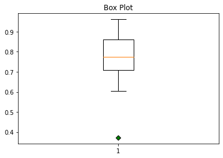


Dal Box Plot possiamo osservare che solo un valore di similarità risulta essere un outlier, ovvero un valore anomalo, quindi questo sarà l'errore di etichettatura automatica più grande. I restanti valori sono superiori a 0.6, che comunque è un buon risultato dato che la similarità di Jaccard è compresa nell'intervallo [0,1].

Rappresentiamo i valori di similarità in tre Box Plot, uno per ogni azione. Per prima cosa estraiamo i valori di similarità in 3 vettori distinti. 


```python
sim_take = []
sim_release = []
sim_push = []
for _, value in sim.items():
    if value["action"] == "Prendi":
            sim_take.append(value["similarity"])
    elif value["action"] == "Rilascia":
        sim_release.append(value["similarity"])
    else:
        sim_push.append(value["similarity"])
print("TAKE:", sim_take, "\n")
print("RELEASE:", sim_release, "\n")
print("PUSH:", sim_push, "\n")
```

    TAKE: [0.6038647342995167, 0.8650519031141864, 0.8620689655172413, 0.7500000000000008, 0.7480314960629967, 0.7933884297520662, 0.8547008547008534] 
    
    RELEASE: [0.37216226274655734, 0.7070993914807296, 0.8317757009345798, 0.8771929824561426, 0.9615384615384623, 0.8653846153846148, 0.7542372881355939] 
    
    PUSH: [0.842105263157895, 0.6365688487584678, 0.7142857142857147, 0.6944444444444421] 


```python
box_plot([sim_take, sim_release, sim_push])
```

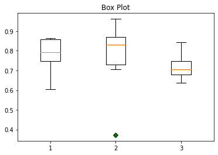

​    


### Conclusione

In questo secondo grafico possiamo osservare che l'outlier appartiene alle azioni di RELEASE. Dai tre Box Plot possiamo ricavare che i risultati di similarità tra le etichette automatiche e quelle manuali, nel video analizzato, hanno valori alti che ci permettono di confermare che anche attraverso uno studio quantitativo l'etichettatura automatica può essere accettata.