# LSTM

| Prova n.      | 1     |
| ------------- | ----- |
| Epoche        | 500   |
| Learning Rate | 0.004 |

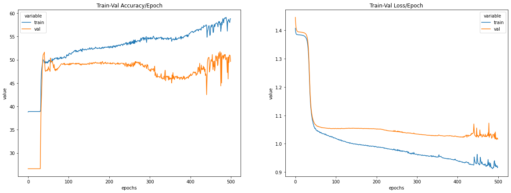

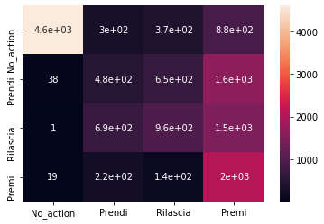

In questa prova non era ancora stato inserito il grafico sulla metrica F1-score.

| Prova n.      | 2     |
| ------------- | ----- |
| Epoche        | 500   |
| Learning Rate | 0.001 |

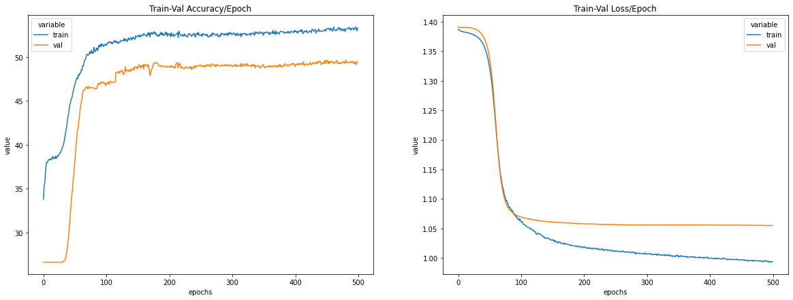

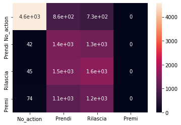

In questa prova non era ancora stato aggiunto il grafico sulla metrica F1-score.

| Prova n.      | 3     |
| ------------- | ----- |
| Epoche        | 500   |
| Learning Rate | 0.001 |

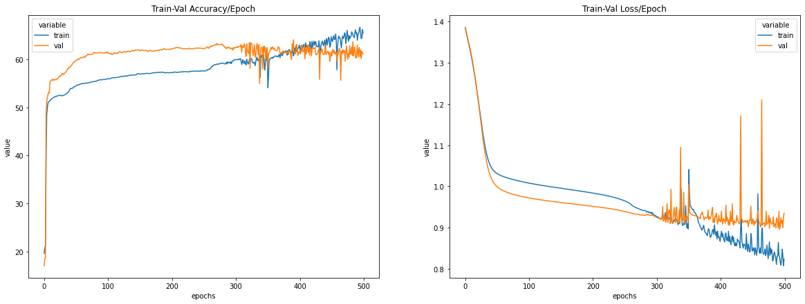

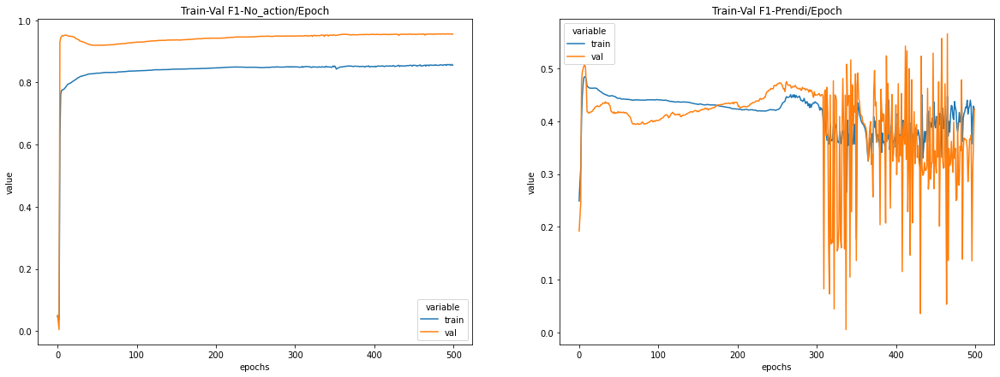

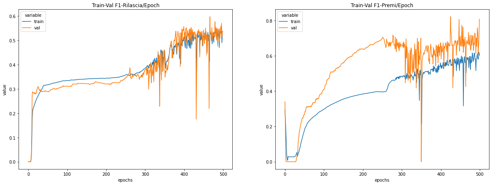

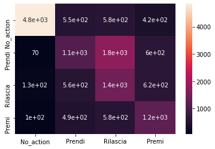

| Prova n.      | 4     |
| ------------- | ----- |
| Epoche        | 500   |
| Learning Rate | 0.004 |

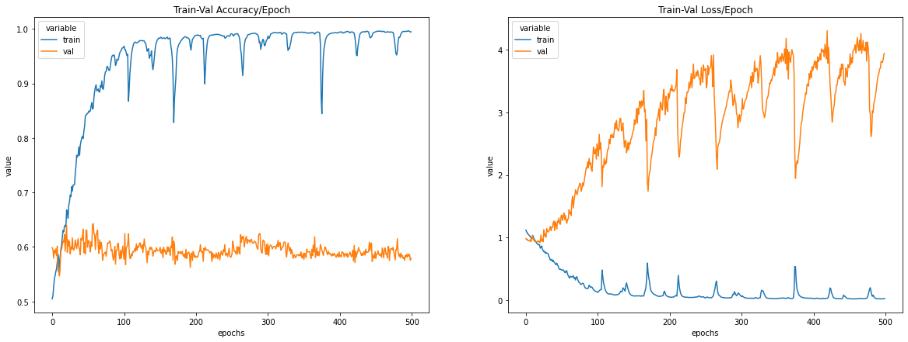

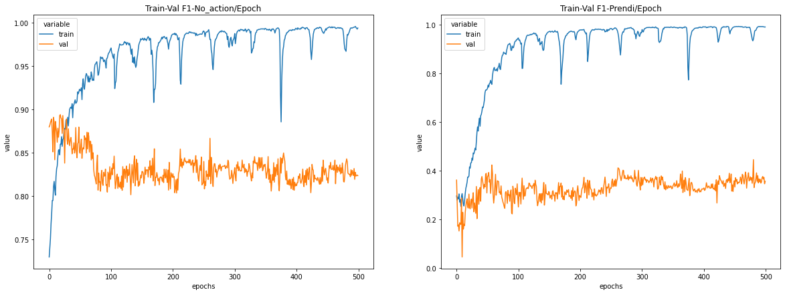

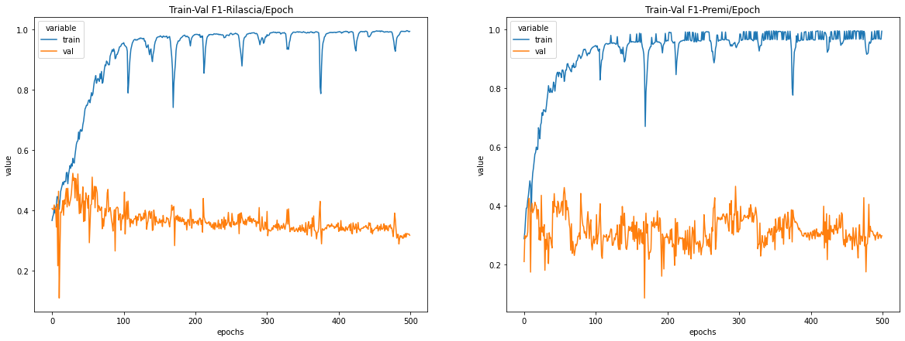

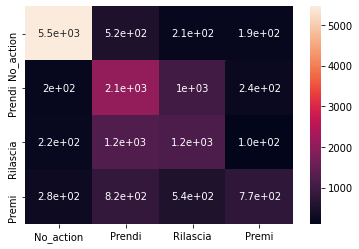

| Prova n.      | 5    |
| ------------- | ---- |
| Epoche        | 500  |
| Learning Rate | 0.1  |

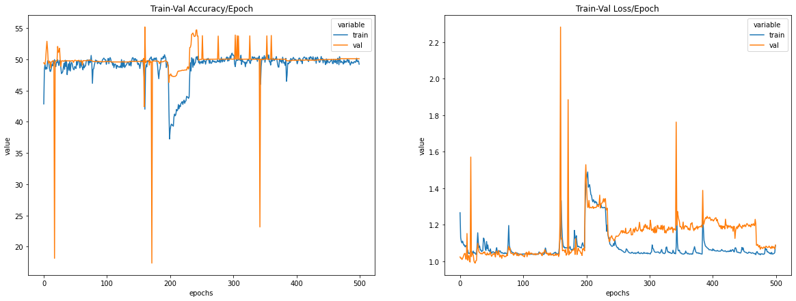

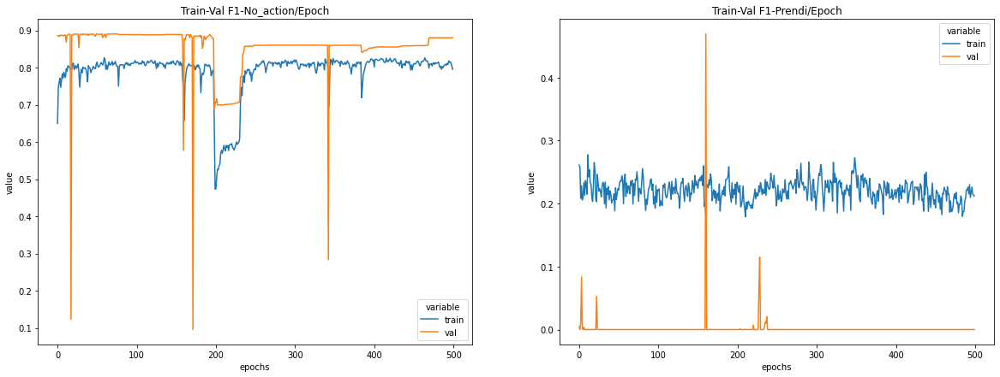

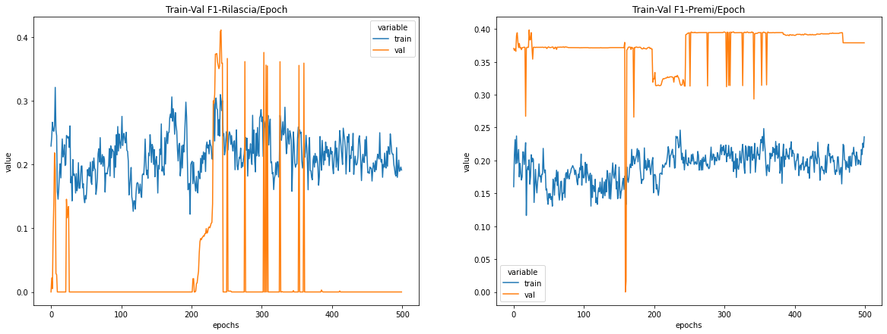

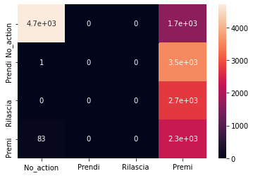

| Prova n.      | 6    |
| ------------- | ---- |
| Epoche        | 50   |
| Learning Rate | 0.04 |

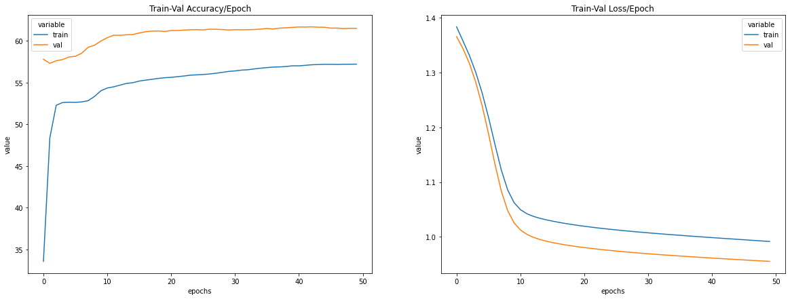

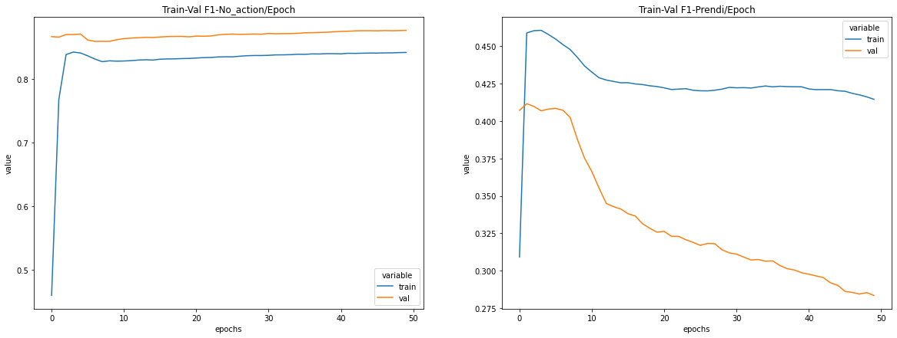

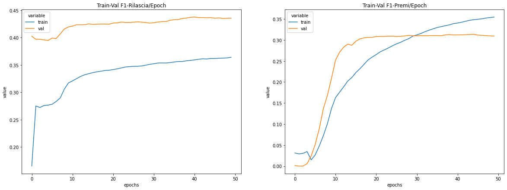

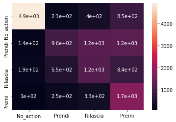

| Prova n.      | 7    |
| ------------- | ---- |
| Epoche        | 200  |
| Learning Rate | 0.06 |

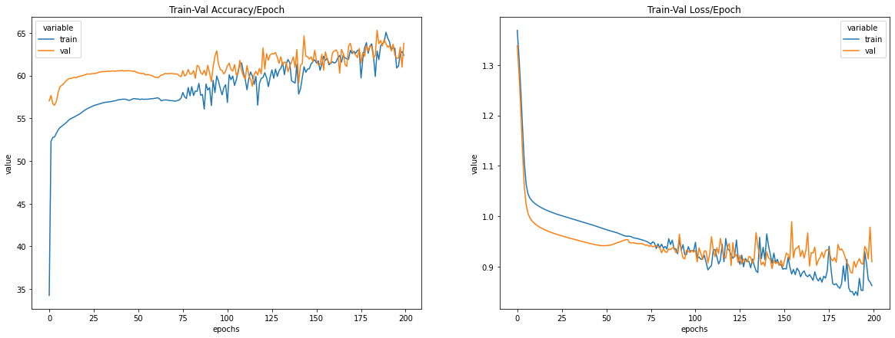

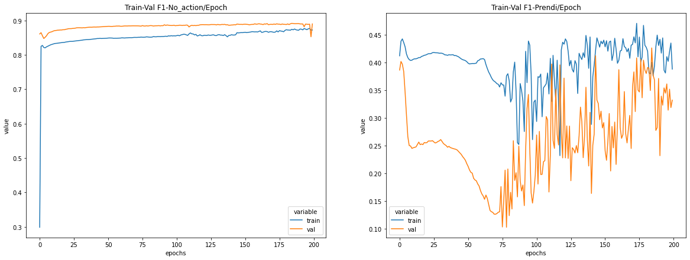

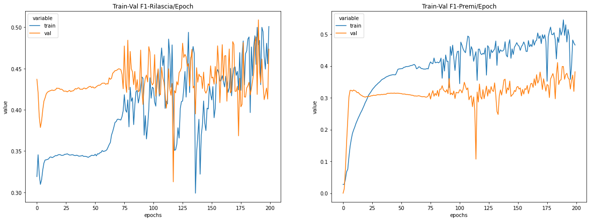

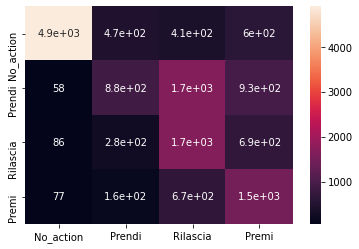

| Prova n.      | 8    |
| ------------- | ---- |
| Epoche        | 50   |
| Learning Rate | 0.06 |

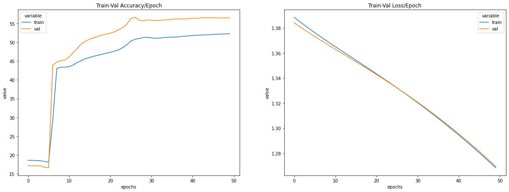

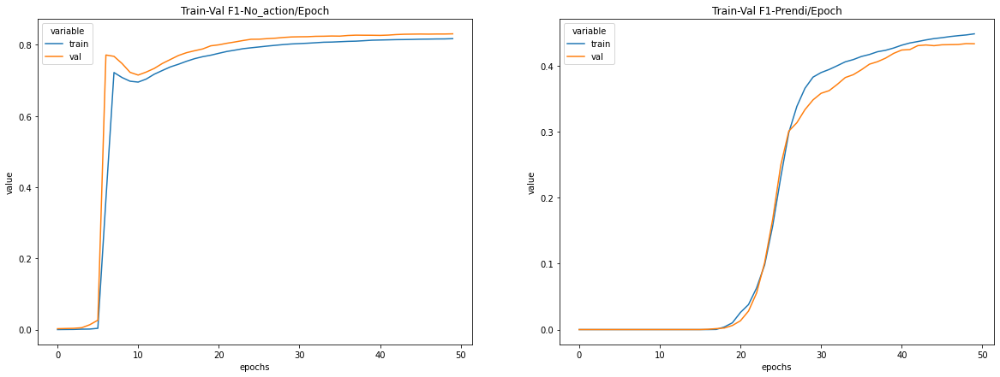

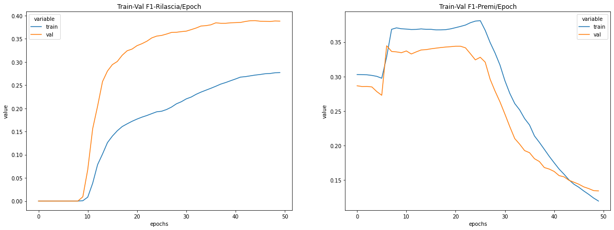

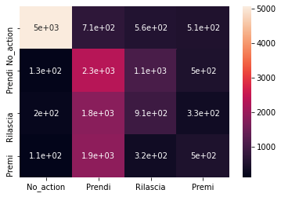

